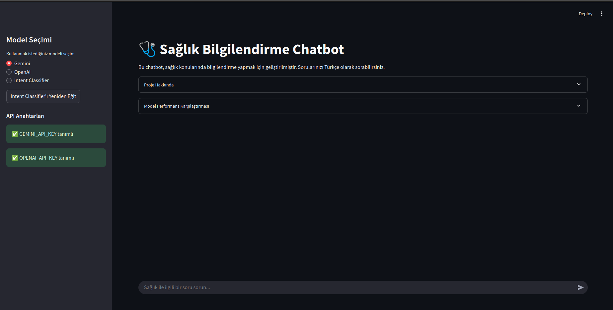
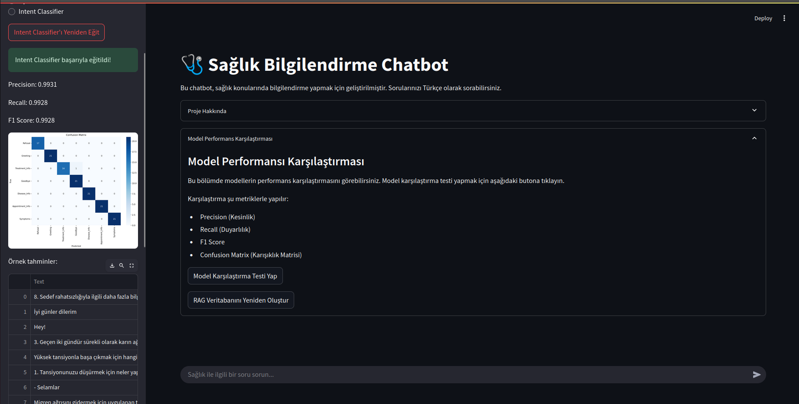
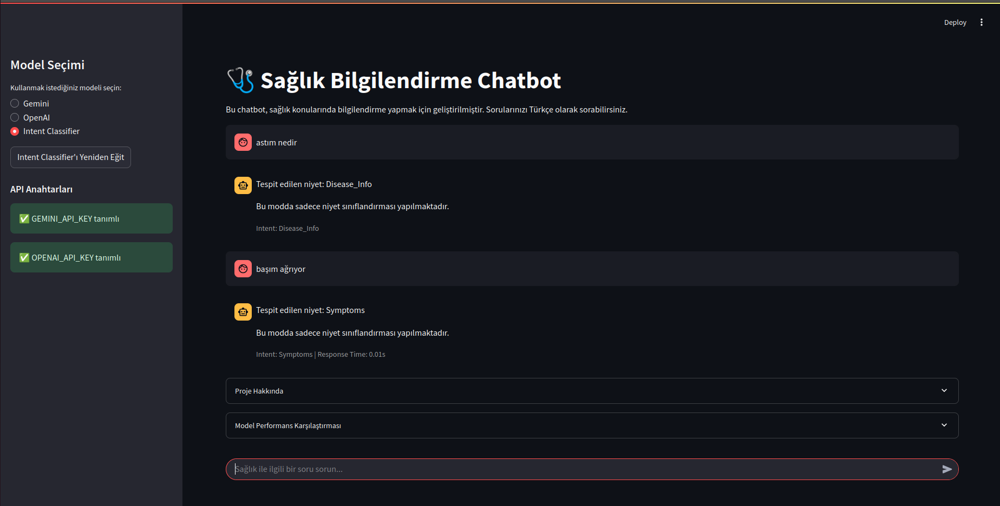
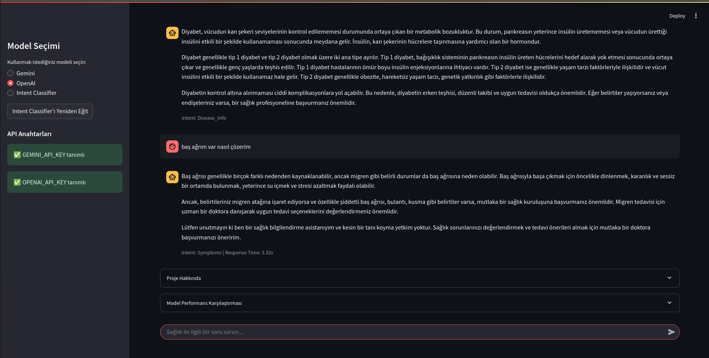
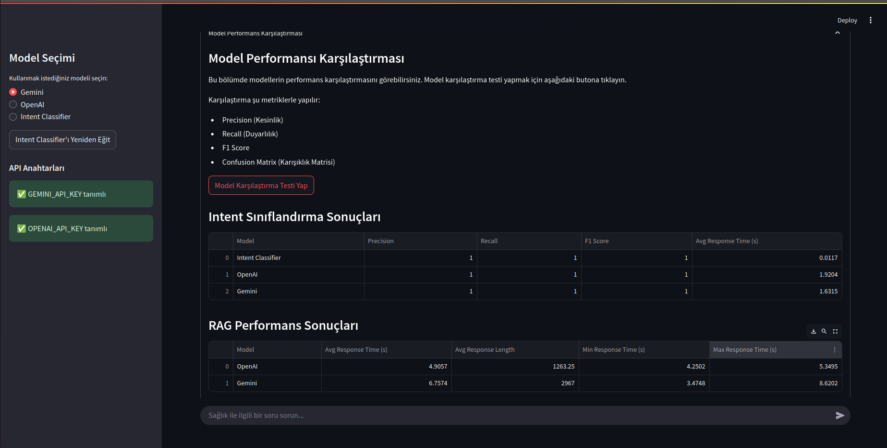
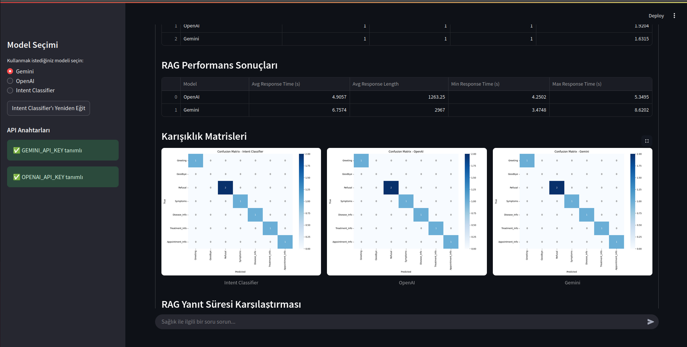
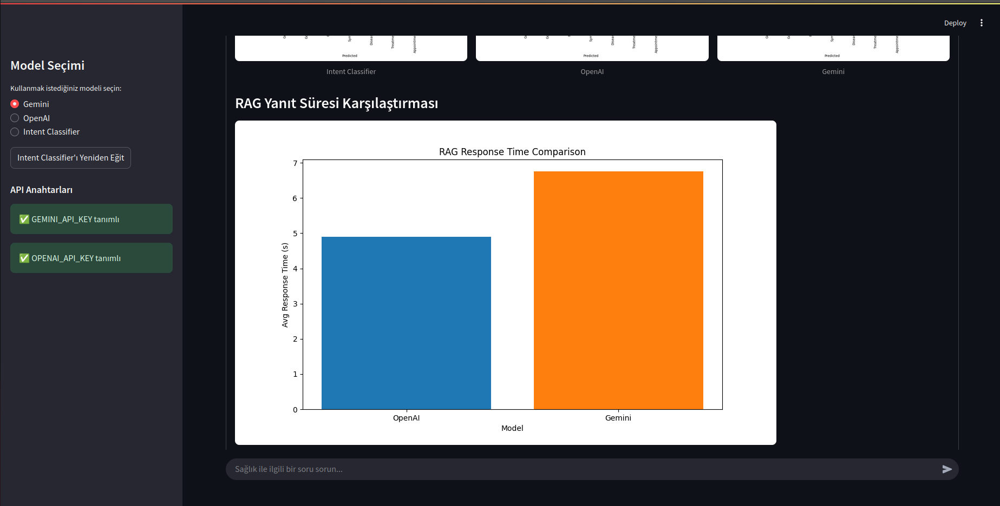

# Sağlık Bilgilendirme Chatbotu

Bu proje, kullanıcı niyetini (intent) sınıflandıran ve sağlık bilgileri sunan bir chatbot sistemi içerir. Sistem, kullanıcı sorularını analiz ederek uygun kategoride sınıflandırır ve doğru, güncel sağlık bilgilerini sunmak için Retrieval Augmented Generation (RAG) teknolojisini kullanır.

## Proje Özellikleri

- **Kullanıcı Niyet Sınıflandırma**: Kullanıcı mesajlarını 7 farklı niyet kategorisinde sınıflandırır:
  - Greeting (Selamlama)
  - Goodbye (Vedalaşma)
  - Refusal (Reddetme)
  - Symptoms (Belirtiler)
  - Disease_Info (Hastalık Bilgisi)
  - Treatment_Info (Tedavi Bilgisi)
  - Appointment_Info (Randevu Bilgisi)

- **RAG Sistemi**: Hastalık, belirtiler ve tedavi bilgileri için gerçek sağlık verilerini kullanan retrieval sistemi
- **Çoklu Model Desteği**: OpenAI GPT ve Google Gemini modellerini destekler
- **Değerlendirme Sistemi**: Modellerin performansını karşılaştırmak için ölçüm araçları

## Çalışma Mantığı

Sağlık Chatbotu şu adımlarla çalışır:

1. **Kullanıcı Sorusu Alınması**: Kullanıcı, chatbot arayüzünden bir soru sorar.
2. **Niyet Sınıflandırma**: Intent Classifier, kullanıcı sorusunu analiz ederek hangi kategoriye ait olduğunu belirler.
3. **Bilgi Retrieval**: RAG sistemi, sağlık veritabanından ilgili belgeleri bulur (hastalık, belirti veya tedavi soruları için).
4. **Yanıt Oluşturma**: Seçilen LLM (OpenAI veya Gemini), ilgili bağlamı kullanarak doğru ve bilgilendirici bir yanıt üretir.
5. **Yanıtın Sunulması**: Oluşturulan yanıt, kullanıcıya chatbot arayüzü üzerinden sunulur.


## Kurulum

### Gereksinimler

- Python 3.8 veya daha yüksek bir sürüm
- pip (Python paket yöneticisi)

### Adım 1: Projeyi İndirin

```bash
git clone https://github.com/yusufbilalusta/health-chatbot
cd health-chatbot
```

### Adım 2: Sanal Ortam Oluşturun ve Etkinleştirin

```bash
# Sanal ortam oluşturma
python3 -m venv myenv

# Windows'ta etkinleştirme
myenv\Scripts\activate

# Linux/Mac'te etkinleştirme
source myenv/bin/activate
```

### Adım 3: Gerekli Paketleri Yükleyin

```bash
pip install -r requirements.txt
```

### Adım 4: API Anahtarlarını Ayarlayın

Projenin kök dizininde `.env` adında bir dosya oluşturun ve aşağıdaki API anahtarlarını ekleyin:

```
OPENAI_API_KEY='your_openai_api_key'
GEMINI_API_KEY='your_gemini_api_key'
```

## Kullanım

### Chatbot Uygulamasını Çalıştırma

```bash
python3 app.py
```

Bu komut, Streamlit tabanlı chatbot arayüzünü başlatacaktır. Web tarayıcınızda otomatik olarak açılacak ve chatbot arayüzüne erişebileceksiniz.

### Örnek Sorular

Chatbot'a şu tür sorular sorabilirsiniz:

- "Merhaba, nasılsınız?"
- "Baş ağrısı için ne yapmalıyım?"
- "Diyabet nedir?"
- "Hipertansiyon tedavisi nasıl yapılır?"
- "Doktor randevusu nasıl alabilirim?"

## Model Değerlendirme

Chatbot modellerinin performansını değerlendirmek için: (Streamlit uygulamasından model performansını karşılaştır butonu ile çalıştırılabilir.)

```bash
python3 evaluate_health_chatbot.py
```

Bu komut, farklı modellerin (OpenAI, Gemini) niyet sınıflandırma ve RAG performansını karşılaştıran grafikleri ve metrikleri oluşturacaktır.

## Proje Yapısı

```
health-chatbot/
├── app.py                      # Ana uygulama ve başlatma kodu
├── app/
│   └── streamlit_app.py        # Streamlit web arayüzü
├── data/
│   ├── download_dataset.py     # Veri seti indirme scripti
│   ├── intents_dataset/        # Niyet veri seti
│   └── rag_corpus/             # RAG için sağlık verileri
├── db/                         # Vektor veritabanı dosyaları
├── models/
│   ├── intent_classifier.py    # Niyet sınıflandırma modeli
│   ├── gemini_model.py         # Google Gemini modeli
│   └── gpt_model.py            # OpenAI GPT modeli
├── retriever/
│   └── rag_engine.py           # RAG sistemi
├── evaluate_health_chatbot.py  # Model değerlendirme scripti
└── requirements.txt            # Gerekli paketler
```

## Teknik Detaylar

### Niyet Sınıflandırma

Sistem, kullanıcı mesajlarını sınıflandırmak için sentence-transformers tabanlı bir makine öğrenimi modeli kullanır. Bu model, önceden hazırlanmış bir veri seti üzerinde eğitilmiştir ve yeni mesajların hangi kategoriye ait olduğunu tahmin edebilir.

### RAG Sistemi

Retrieval Augmented Generation (RAG), büyük dil modellerinin doğru ve güncel bilgiler sunmasını sağlayan bir tekniktir. Sistem:

1. Kullanıcı sorusuna en uygun sağlık verilerini bulur
2. Bu verileri model tarafından kullanılacak bağlam olarak sağlar
3. Büyük dil modeli, bu bağlamı kullanarak daha doğru ve bilgilendirici yanıtlar oluşturur

Bu yaklaşım, modelin halüsinasyon oluşturma riskini azaltır ve verilen bilgilerin güvenilirliğini artırır.

## Arayüz Görüntüleri

### Ana Sayfa


### Intent Sınıflandırma



### Sağlık Bilgileri Sorgusu


### Model Performansı




## Lisans

Bu proje [MIT Lisansı](LICENSE) altında lisanslanmıştır. 